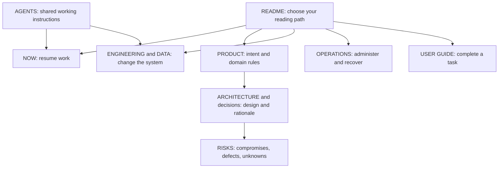

# Vibe Code Docs Stack — Research and Playbook

Designed for builders using AI coding tools, with eventual engineer and operator handover. The provider examples cover GitHub, Vercel, and Supabase or Neon; the documentation questions also apply to other stacks. Provider claims and their verification scope are maintained in the [optional provider reference](skills/vibe-code-docs-stack/references/providers.md).

## Recommendation

Keep the project's durable knowledge in its repository, as short Markdown documents maintained alongside code. Organize it around questions a returning owner or new teammate must answer: why does this exist, what is actually built, why was it built this way, where are the weaknesses, and how do I run it?

Make human and agent handovers reading paths through the same information. Give every fact one canonical home. Keep transient work state separate from lasting product and architectural reasoning.

This structure is a practical synthesis of documentation frameworks and provider documentation, not a standardized industry file layout. Its design goals are low reading effort, easy resumption, explicit uncertainty, and little duplicate maintenance. Individual projects still require verification against their own implementation and configuration.

## What the research contributes

**Docs as Code** provides the maintenance mechanism: plain text, version control, reviews, and checks integrated into development. The useful implication for you is that the code change and the explanation of that change travel together. [Write the Docs](https://www.writethedocs.org/guide/docs-as-code/)

**Diátaxis** distinguishes tutorials, task instructions, reference, and explanations. Apply that distinction inside the documents when necessary: a first-use walkthrough, a procedure for an experienced operator, an exact reference, and the reasoning behind a design serve different needs. [Diátaxis](https://www.diataxis.fr/start-here/)

**arc42** supplies a coverage checklist for architectural context, constraints, runtime behavior, deployment, quality requirements, risks, and terminology. Borrow its questions and adapt the amount of detail to the project. [arc42 overview](https://arc42.org/overview/)

**Architecture decision records (ADRs)** preserve consequential choices, alternatives, and consequences, including why a previous choice was reasonable. Keep their history when a later decision supersedes them. [arc42 decision guidance](https://docs.arc42.org/section-9/)

**C4** supplies levels of architectural diagrams. Its own guidance says context and container diagrams are sufficient for most teams. In C4, a container is an application or data store; it does not necessarily mean Docker. Add deeper diagrams only for genuinely difficult areas. [C4 diagrams](https://c4model.com/diagrams)

**Google SRE's operational guidance** connects alerts, structured playbooks, handoffs, practice, and updating instructions as production changes. Adapt this to a small team with a few tested procedures and clear ownership. [Google SRE workbook](https://sre.google/workbook/on-call/)

The filenames, size guidance, lifecycle stages, and review cadence below are the kit's recommendations, not requirements imposed by those frameworks.

## The canonical documents

| File | Question it answers | Minimum useful content | Update trigger |
|---|---|---|---|
| `README.md` | Where do I start? | One-sentence purpose; live/demo links; owner; links for return, build, operate, use | Entry points or ownership change |
| `NOW.md` | Where did we leave this? | Current objective; implemented versus deployed state; branch/commit; next action; blocker; active work links; evidence date | Meaningful checkpoint, interruption, handover |
| `AGENTS.md` | How must a coding agent work here? | Reading order; key constraints; how to find real commands; documentation update rules; verification expectations | Workflow or invariant changes |
| `docs/PRODUCT.md` | Why does this exist? | User and problem; desired outcome; scope/non-goals; domain rules; examples; accepted versus proposed requirements | Product decisions change |
| `docs/ARCHITECTURE.md` | How does it work, and why this design? | Current system map; key workflow; trust boundaries; component-to-code map; constraints; decision index; measured versus assumed limits | System boundaries, flows, dependencies, or major choices change |
| `docs/RISKS.md` | Where are the problems? | Bugs, deliberate shortcuts, unverified assumptions, missing tests, operational gaps; impact, evidence, workaround, owner, revisit trigger | Discovery, mitigation, decision, resolution |
| `docs/ENGINEERING.md` | How do I change it reliably? | Reproducible setup; versions; actual commands; tests; safe test data; migrations; coding conventions that matter | Setup, commands, tests, development process change |
| `docs/DATA.md` | What does the data mean and who can access it? | Schema source; relationship diagram; business meanings; ownership/access rules; lifecycle; integration contracts | Schema, policies, data semantics, or contracts change |
| `docs/OPERATIONS.md` | How do I own and run the service? | Accounts, environments, costs, administration, releases, diagnosis, recovery, maintenance, escalation | Hosted configuration, operational behavior, ownership changes |
| `docs/USER-GUIDE.md` | How do I achieve my task? | First success; routine tasks; roles; expected results; common errors; recovery/help | Actual user workflows change |

This is a coverage map, not a demand for ten large manuals. Create the first six for a project you intend to keep. Add engineering instructions as soon as it runs, data documentation when it persists data, operations when it is hosted, and a user guide when another person uses it. These triggers may all occur on day one for an existing application.

An early document can be a few paragraphs. Clearly marked unknowns are useful. Empty headings that make the project look complete are not.

Use `docs/decisions/` for consequential decisions as they occur. Use `docs/features/` only when a feature needs a specification longer than a short issue. Use `docs/runbooks/` when operational procedures become too long for the operations page. None needs a folder of empty files at project inception.

## The most important information: intent, compromise, and evidence

An incoming engineer can usually inspect a function. They cannot reliably recover the founder's intent, a rejected option, or the reason a shortcut was accepted by inspecting code.

Write down:

- The user problem and the smallest outcome that would make the project worthwhile.
- The constraints at the time: time, budget, available skills, deadlines, existing systems, expected use.
- Domain invariants: rules that must remain true even during a redesign, such as who owns a record or what counts as a completed transaction.
- Alternatives actually considered, and why the selected option fit those constraints.
- The consequences and the limits of the choice.
- The trigger for revisiting it, with measurements or concrete events when possible.

For significant decisions, use a one-page ADR: context; status; decision; alternatives; rationale; consequences; revisit trigger; evidence and related risk links. Never invent historical deliberations from the code. If reconstructing the past, label the rationale as inferred and ask the owner to confirm only what matters.

**Illustrative decision, not a finding about your projects:**

> We process uploaded CSV files during the web request because the pilot uses small files and we wanted to avoid operating a queue. This creates request-duration and retry limitations. Current maximum supported size is unmeasured. Before bulk imports or automatic retries are promised to customers, measure representative imports and assess background jobs with idempotent processing. See the linked risk and import code.

That explanation allows an engineer to preserve the product behavior while improving the implementation. It does not precommit them to a speculative rewrite.

Keep a small section in architecture called **Evidence and limits**. Distinguish measured load, expected load, configured limits, and untested assumptions. An untested system has unknown capacity; it does not have a trustworthy user-count limit derived from its technology choices.

## Make problems discoverable

`RISKS.md` is the engineer's starting point for assessment. Keep the most consequential unresolved items at the top. Distinguish known defects from deliberate shortcuts and unverified suspicions.

For each item record:

- A stable identifier and category.
- Trigger and user/business impact.
- Evidence: reproduction, test, code path, log reference, or explicit absence of verification.
- Current workaround or containment, and its limits.
- Owner, status, and next action or linked issue.
- A date or event that triggers reconsideration.

Do not label every cleanup as urgent. A readability concern, a measured bottleneck, and a possible cross-account data exposure need different responses. A prototype can defer performance work; its essential data and access behavior still needs to be understood.

Choose one canonical backlog: usually GitHub Issues. `NOW.md` links to the current work. `RISKS.md` explains system-level exposure and links to implementation issues, rather than duplicating every issue's checklist and status. If a project has no issue tracker, a compact backlog section in `NOW.md` is sufficient initially.

Keep a public risk summary useful without publishing exploit steps, affected customer records, or sensitive incident evidence. Put restricted details in an access-controlled record outside the public repository and use a safe reference and access route. A file named `PRIVATE.md` inside a public repository is still public. Apply the same boundary to the [operations inventory](#operations-includes-both-administrators-and-technical-operators).

## Operations includes both administrators and technical operators

Your teammate may manage the product without modifying code. `OPERATIONS.md` must make that work explicit.

| Product administration | Technical operations |
|---|---|
| Invite, approve, suspend, and remove users | Identify the deployed version and environment |
| Change roles and understand access consequences | Deploy and verify a release |
| Correct records using supported workflows | Diagnose failed requests or jobs |
| Moderate, approve, import, export, or reconcile | Check monitoring and provider logs |
| Retry a business process without duplicating effects | Recover data or revert an application release |
| Handle common customer questions and escalation | Rotate credentials, maintain dependencies, monitor costs |

Include only the activities the application actually supports. Mark missing admin capabilities and manual workarounds honestly.

A useful procedure states: when to use it; required role; target environment; prerequisites; steps; expected outcome; verification; stop/escalation conditions; last exercised date and evidence. A guide saying “check the database” is not enough for independent operation.

Document what a person can decide themselves, what requires an engineer, and who owns an incident. Store credential locations and access-request instructions, never credential values, including in private repository documents. Inspect configuration names, scope, and exposure without retrieving secret values. In a public repository, keep internal account/billing/incident details in an access-controlled companion document outside that repository, with an explicit owner and a safe pointer or access route.

## Details your hosting and database stack especially needs

The [provider reference](skills/vibe-code-docs-stack/references/providers.md) holds dated facts and primary-source links for Supabase, Neon, and Vercel. Read only the matching sections. For another stack, answer the same questions below using its current documentation and the project's actual settings. Documentation does not establish that infrastructure has been configured or authorize changing it.

### Environment map

For local, preview, staging if used, and production, map the application URL and hosting project to the actual database project/branch, auth configuration, storage, external integrations, and configuration source. Record whether non-production data is copied from production, who can reach each preview, and how stale environments are removed. An isolated preview frontend does not by itself establish an isolated backend or sanitized data.

Record variable names, purposes, client/server exposure, secure source, and environment/branch overrides, using safe placeholders in `.env.example`. Establish the deployed mapping from redacted deployment or integration evidence; project settings alone may omit injected variables. See [Vercel configuration](skills/vibe-code-docs-stack/references/providers.md#vercel) and [Neon integration behavior](skills/vibe-code-docs-stack/references/providers.md#neon).

### Supabase

Record services actually used and their access boundaries. Establish the exposed tables/views/functions, grants and RLS state, policy tests, and privileged server paths. Record relevant advisor findings or lack of inspection, and the evidence for preview isolation. The [Supabase reference](skills/vibe-code-docs-stack/references/providers.md#supabase) explains key types, branching, connection modes, and backup exclusions.

Choose a migration workflow and reconcile dashboard changes with version-controlled migrations. Supabase distinguishes the migration files in Git from the history of migrations applied to a database; both matter when diagnosing drift. Document the actual state instead of claiming migrations are authoritative merely because a folder exists. [Supabase migrations](https://supabase.com/docs/guides/deployment/database-migrations)

Capture verified database and file recovery coverage, retention, configuration/integration recovery, and the last isolated exercise. A database copy is only one part of recovering the application.

### Neon

Record the production branch, each non-production branch's purpose and parent, data-copy policy, application/tool connection modes, cleanup ownership, and actual history window. Define how schema changes reach production. The [Neon reference](skills/vibe-code-docs-stack/references/providers.md#neon) distinguishes ordinary data copies, schema-only branches, past-data branches, and restoration that replaces a target's timeline.

### Deployment and recovery

Record where migrations run: build step, CI, manual procedure, or provider integration. Name the target and connection used in each environment, ordering relative to deployment, and safeguards against preview builds changing production. Keep application rollback and database recovery separate. Release notes should explain schema compatibility with earlier code; the rollback runbook should cover configuration, scheduled jobs, and resuming normal promotion. See [Vercel deployment and rollback behavior](skills/vibe-code-docs-stack/references/providers.md#vercel).

An isolated recovery exercise identifies a separate disposable project/branch and the exact method that leaves production untouched. Plan access to copied data, test-only integrations, verification, and cleanup. Provider features can support either replacing an existing target or creating a separate copy; the word “restore” alone does not identify which. Use the matching [provider procedure](skills/vibe-code-docs-stack/references/providers.md) within the exercise's actual authorization.

Record the acceptable data-loss interval and recovery-time target in plain language, followed by what is actually demonstrated. For example: “Desired recovery within two hours; not yet tested.” Do not convert a provider's backup feature into an unverified claim that the whole application can be restored.

### Dependency and ownership inventory

Include GitHub organization/repository, hosting team/project, database project, domain registrar/DNS, email provider, payments if used, storage, analytics, and monitoring. For each: purpose, owner, access route, billing owner, plan/add-ons, usage drivers, limit behavior, cost evidence, and renewal/maintenance obligations. Identify how an owner learns about failure, who receives alerts, and how long diagnostic logs survive. Document configurations that are only in dashboards and cannot be recreated from Git. Use the [plan and pause questions](skills/vibe-code-docs-stack/references/providers.md#plans-evidence-and-long-pauses) to expose gaps rather than assuming a managed service includes backup, alerting, or a total spending ceiling.

## Transfer across agents and tools

Use `AGENTS.md` as the shared project contract. Keep it short and point to task-relevant documents rather than automatically loading the entire stack.

| Tool | Repository entry point | Practical approach |
|---|---|---|
| Codex | `AGENTS.md` | Root instructions plus scoped guidance where appropriate; check which files loaded |
| Claude Code | `CLAUDE.md` | Use `@AGENTS.md` to import the common contract |
| Cursor | Root `AGENTS.md` or project rules | Start with the common file; introduce scoped rules only when needed |
| Any other harness or ordinary chat | Varies | Explicitly supply the contract, current state, and relevant files; verify access |

Codex documents instruction discovery and precedence, including overrides. A file existing somewhere in a repository is not proof it was loaded. [Codex instructions](https://learn.chatgpt.com/docs/agent-configuration/agents-md)

Claude Code documents the `@AGENTS.md` import and distinguishes project instructions from machine-local auto memory. Durable decisions need promotion into repository documents. [Claude Code memory](https://code.claude.com/docs/en/memory)

Cursor documents root `AGENTS.md` support and more selectively applied project rules. [Cursor rules](https://prod.cursor.com/help/customization/rules)

For a fresh session, ask the agent to identify the current branch, read the relevant instructions and `NOW.md`, inspect the implementation, and report the objective, constraints, next step, and any contradiction. This is a short orientation check, not an approval ritual before every action.

For a move between environments, transfer the code and documentation together. A local uncommitted file does not travel just because a GitHub repository exists. Record what is pushed, what is only local, and where the target agent should resume. Connected accounts, tool permissions, dependencies, and secrets must be configured in the receiving environment separately.

For parallel work, each feature branch or issue owns its work note. Keep `NOW.md` as the concise project index; avoid several agents replacing it with incompatible task narratives.

## Turn long planning conversations into durable context

At the end of a design conversation, request an extraction with four explicit classes: accepted decisions, proposals, assumptions, and unresolved questions. Include user/domain context and rejected alternatives only where their reasoning matters. Keep links to original research or conversation excerpts as provenance, subject to access and privacy.

The implementation agent should compare the extracted proposal with the actual repository. It should route product intent into `PRODUCT.md`, accepted major choices into ADRs, current implementation into `ARCHITECTURE.md`, uncertainty into `RISKS.md`, and the next task into `NOW.md` or its issue.

Keep a dated original proposal in an optional archive when valuable. Label it historical. It must not silently override later decisions or become the active specification simply because it is long and detailed.

## Maintenance that can survive interruptions

“Keep all docs updated” is too ambiguous. Attach updates to specific events:

| Change | Update |
|---|---|
| Product behavior or scope | Product and relevant user task; feature/issue acceptance criteria |
| Major design choice | Architecture and ADR; linked risk if a compromise remains |
| Schema, access policy, integration contract | Versioned implementation and relevant data explanation |
| Setup command or test process | Engineering guide |
| Hosted configuration, deploy, alert, recovery | Operations and affected runbook |
| New defect or uncertain assumption | Risk register and linked issue |
| Pause or harness switch | Current state, evidence, transferable work location, exact next action |
| Release | Release record linking deployed commit, migrations, verification, and recovery notes |

Put a documentation-impact question in the pull request template, including “not affected” with a short reason. GitHub supports repository PR templates under `.github/`. [GitHub PR templates](https://docs.github.com/en/communities/using-templates-to-encourage-useful-issues-and-pull-requests/creating-a-pull-request-template-for-your-repository)

Start automated checks with broken internal links and generated artifact drift where generators already exist. As the repo matures, verify documented setup in a clean environment, apply migrations to a disposable database, and exercise important user and access-control paths. Treat path-based “docs may need updating” checks as heuristics; a mandatory unrelated Markdown edit proves nothing.

An AI reviewer can identify likely omissions. It cannot prove that historical reasoning is true or that a restore procedure works. Pair critical claims with code, test results, deployment records, or a recorded exercise.

Use “last verified” only for an actual check. For changing operational facts, record date, environment, evidence, and relevant code revision. Avoid a self-referential commit hash: a tested code SHA or CI run is enough; the document commit itself will have its own identity in Git.

Make checkpoints at the end of meaningful work units rather than relying only on a perfect end-of-session handoff. If a session ends unexpectedly, the next agent should reconstruct state from Git, issues, and evidence, label uncertainty, and proceed with what it can establish.

## A small interface for your returning self

Use a consistent README reading order across projects and keep `NOW.md` roughly a screen or two. About 300–500 words is an upper guide, not a minimum; link to detail instead of padding the checkpoint.

Lead with: what this is; why it matters; what's working; what's broken or unknown; the next concrete action. Distinguish implemented, tested, and deployed. Avoid unexplained traffic-light status and percentage-complete estimates.

Keep one private portfolio index across projects with: project, active/paused/maintained/retired, purpose, README/NOW links, owner, and next review date. Add cost and operational obligations only where they help you remember a live service. Link to project state instead of manually duplicating its full status.

For a paused project, record why it was paused, what still runs and costs money, who receives alerts, and what would justify returning. Also record usable database/file recovery sources, provider idle and resume behavior, runtime and credential expiry, and expected resume checks. Set the next review before the earliest relevant deadline; see [provider pause guidance](skills/vibe-code-docs-stack/references/providers.md#plans-evidence-and-long-pauses). For a retired project, record data retention/deletion and export arrangements, remaining ownership or domain obligations, and planned credential/integration revocation. These are lifecycle decisions to document, not authorization to change or delete infrastructure.

## Demonstrate the handover

A handover is complete when the recipient can perform the work with the documents, suitable access, and reasonable support. The checklist is a dated evidence record linking the canonical docs; it is not another manual.

**Engineer exercise:** explain the product outcome and main tradeoffs; run from a clean checkout; trace a core flow from UI to storage; identify the priority risks; make a small change; run relevant checks; explain migration and recovery constraints. Preview deployment belongs only within the recipient's role and authorization. Before taking responsibility for production recovery, exercise the recovery procedure using the separate target described under [deployment and recovery](#deployment-and-recovery).

**Operator exercise:** get the right access; complete the main routine admin tasks; distinguish normal behavior from failure; locate logs/alerts when appropriate; handle one representative problem; demonstrate escalation; confirm billing and maintenance ownership. Technical recovery belongs to the role authorized and trained to do it.

**User exercise:** reach the first useful outcome from the guide and recover from one common input error. This should not require reading architectural internals.

For ownership transfer, use the [handover record](starter-kit/templates/HANDOVER.md) to distinguish incoming access from account, billing, domain, and integration ownership. Record recovery-access custody without codes, outgoing access removal or an explicit retained-access agreement, and required credential rotation with its owner and status. Documenting these steps does not execute them.

Record gaps, owner, and next action. Label readiness by responsibility: “ready for daily administration; production recovery remains with the founder” is more useful than “handover complete” with unresolved access and recovery gaps.

## Adoption sequence

1. Choose one project you expect to revisit or give to someone else.
2. Use the accompanying bootstrap prompt to inventory existing docs and preserve useful material.
3. Fill the six core documents from evidence and owner-provided intent. Keep unknowns visible.
4. Add engineering, data, operations, and user documentation as their lifecycle triggers apply.
5. Introduce the small agent entry points and PR documentation-impact question.
6. Start a new agent session and perform a practical resumption check. Fix what it cannot find.
7. When a teammate arrives, run the role-specific handover exercise and improve the same canonical docs.

Success means you can return with less reconstruction, an engineer can distinguish intent from implementation and deliberate compromises from defects, and an operator can complete their assigned responsibilities. Document count is not a success metric.
